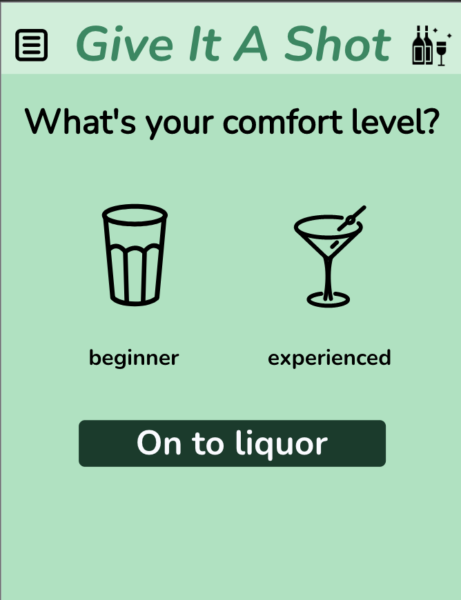
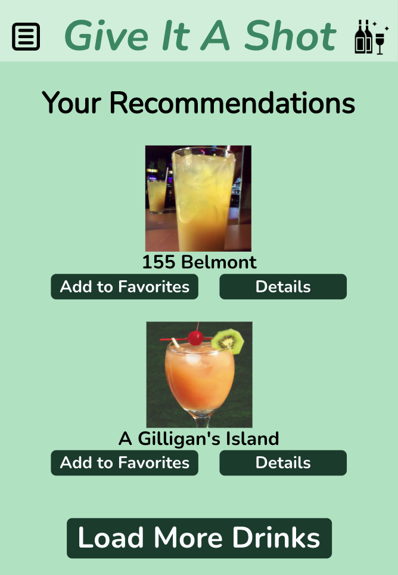
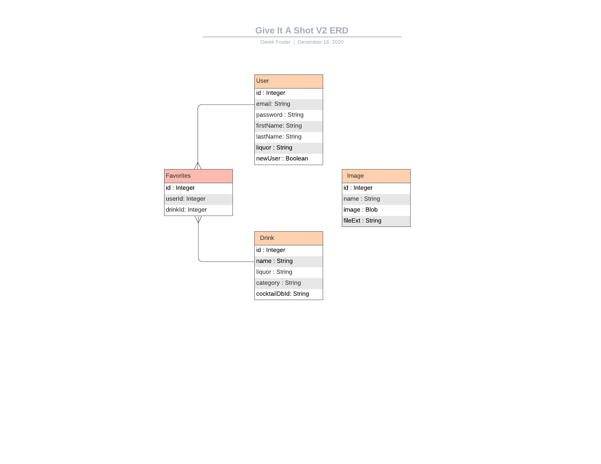
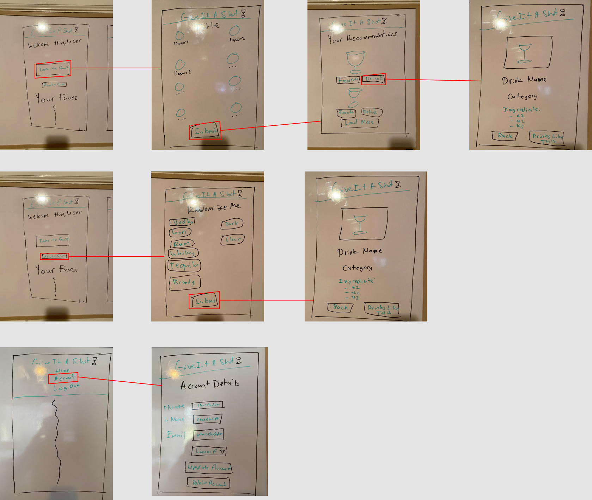

# Give It A Shot V2

We know all know the feeling: standing in a room full of people, unsure if you belong or what to say. In our case, everyone is ordering fancy cocktails and all you know how to say is "Vodka Soda". Give It A Shot changes all of that.

As fledgling cocktail connoisseurs, we love trying new drinks. But, just like you, we _don't even know what we don't know!_ Through Give It A Shot, we'll be able to try any drink known to the publicly available, [Cocktail DB](https://www.thecocktaildb.com/)

## How It Works

Once logged in, you will be taken to our drink quiz to finish setting up your account to your preferences.

From there, you can use Give It A Shot to find new drinks to try or create from your own home.

### Technologies Used

The below technologies used will only cover new additions from the original project; for the "base" technologies/first iteration of this project, please [go here for the original](https://github.com/kelseywhallon/give-it-a-shot#technologies-used)

The front end is done completely with **React.js**. Some highlights:

-   Easy to deploy instance on _heroku_
-   React `context` and `useContext` for better state management
-   Added capability to upload `svg` images to backend and database
-   React-Bootstrap for modal and dropdown

## Running Locally

The hosted version of this web app can be found at: <https://giveitashotv2.herokuapp.com/>

But if you'd like to play with the code yourself, please do the following:
1\. Ensure environment variables are set `API_KEY`
2\. Local database is created, and is set up with the models provided with this repository, and config is changed to point to your database.
    1\. `cd give-it-a-shot-image-sql`
    2\. `createdb give-it-a-shot`
    3\. Create a config.json
    4\. `sequelize db:migrate`
3\. Seed the database with Sequelize:
    1\. `cd give-it-a-shot-api-sql`
    2\. `sequelize db:seed --seed seeders/20201118201018-image-seeder.js`
4\. Dependencies are installed (npm i, both in frontend and backend direc tories)

## Project Planning

At the moment, I use OmniFocus to track stories and completion. As the project grows, I will switch to Trello.

### Entity Relationship Diagram

### Wireflows

## Future Development

-   Refactor Modal - Bootstrap Modal is kinda janky
-   Update Header for better nav set up... current grid + mobile center nav works, but is very brittle. Adding content will break it, should find a more sustainable of navigation
-   Leverage users favorite alcohol from Account page in determining rest of app's recommendations (UX to add: information ON the liquor dropdown itself on the Account page)
-   introduce Babel resolver to use aliases during development
-   find a better way to resize in JS based on viewport width
